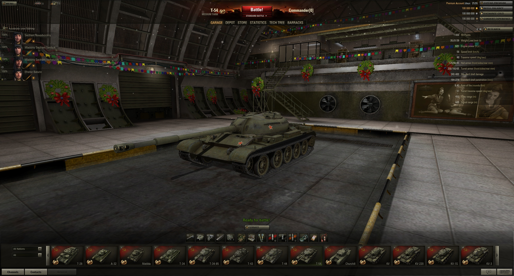

# WoT-Legacy-Offline-Simulation-0.6.2.8
Non-commercial technical simulation of the 0.6.2.8 client battle logic for educational purposes.

Based on creations of Imperator Glekobes

Hello, dear developers and players!

The code below represents a standard Offline Hangar modification for the game version 0.6.2.8. It will allow you to view vehicles, modules, the old interface, etc. This modification is non-commercial, and all rights to the "World of Tanks" trademark and game resources belong to Wargaming.net or Lesta Games. The author of the project makes no claim to the intellectual property of these companies.

Download client: https://archive.org/download/world-of-tanks-versions/EU/0.06/World_of_Tanks_0.06.02.08.00_EU_0000_SD.7z

Requires Python 2.6.6 x32 to be compiled and used in the game or extract two files from this archive into your PjOrion folder and change your Python library to python26.dll via Terminal -> Settings -> Basic setup.
